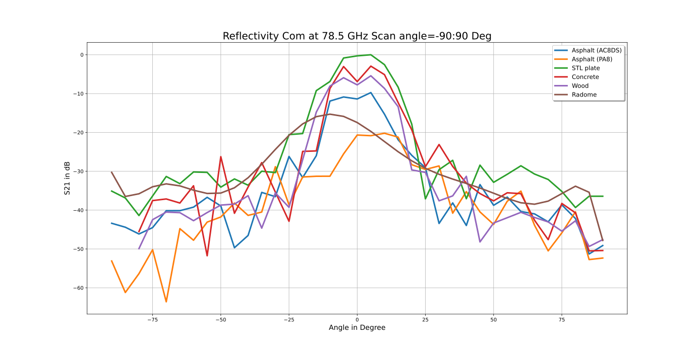
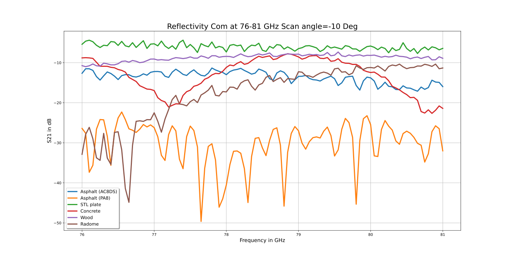

#   VIVALDI Materials

This git repository contains the measured raw data and the generated OpenMATERIAL files of the VIVALDI funded project. In addition, code is stored with which the raw data can be viewed and the OpenMATERIAL files can be generated.

The repo contains extensive measurements in the mmWave range.
In the quasi optical bench (QoB), various materials were measured with a vector analyser and the scattering  parameters were recorded.
In addition, the complex permitivity $\epsilon_r$. 
and permeability $\mu_r$ were calculated from the s-parameters, as these are the physical quantities that are most commonly used. As a small addition, only non-metallic or non-magnetic materials are used here, so the permeability can be assumed to be  $\mu_r = 1 \frac{H}{m}$ or $\mu_r = 1 - 0.00001j \frac{H}{m}$, which significantly simplifies the calculation of permittivity $\epsilon_r$.

## VIVALDI

To this end, virtual test environments are being developed for the sensor systems that are of central importance for connected and automated driving. They are used to simulate the functions of sensors, the impact of the environment, and the representation of scenarios. Different approaches from software-in-the-loop over over-the-air vehicle-in-the-loop up to field-operational tests are pursued in combination. The project is investigating how close to reality such tests can be in a virtual environment and to what extent they can represent the actual complexity of test drives. The aim is to develop realistic models for scenarios, sensors and environments that will enable standardized test procedures. In cooperation with the Japanese partners of the DIVP consortium, complementary scientific approaches and central questions of modelling, simulation and validation are being worked on.

More information about the VIALDI project can be found on the [website](https://www.safecad-vivid.net/).

## OpenMATERIAL

OpenMATERIAL is a proposal that deals with how to exchange data for virtual validation and how to describe and structure this exchange. In the VIVALDI project, we had the same experience and therefore decided to use OpenMATERIAL.

More information about the OpenMATERIAL project can be found on the [website](https://github.com/LudwigFriedmann/OpenMATERIAL).
VIVALDI will follow the proposal of [OpenMATERIA](https://github.com/LudwigFriedmann/OpenMATERIAL) and with this the proposals for extensions to the [Khronos Group glTF 2.0](https://github.com/KhronosGroup/glTF) file format made in the [OpenMATERIAL](https://github.com/LudwigFriedmann/OpenMATERIAL) project.

## Measurement Campaign
In VIVALDI there were several Mass campaigns. The results listed here include material measurements in the QoB. For this purpose, several samples were measured and their dielectric properties in the mmWave range were determined. 

### Measuring principle
A device under test (DuT) is clamped on a receptacle. A horn antenna is placed orthogonally to the sample and transmitting, called Tx-antenna. A second antenna then measures the reflected energy at different angles of incidence, called an Rx antenna. This is how the scattering parameters are determined. In principle, this can be done in the same way for the transmission components.

### Measurements results
The measurement results show the different reflection properties of the material over the frequency and the angle of incidence. Based on these measured s-parameters, the permittivity and permeability can later be determined. Where [Fig 1](#Fig-1) shows the $S21$ in $dB$ over the angle of incidence and [Fig 2](#Fig-2) shows the $S21$ in $dB$ over the frequenz. 

      |  
:-------------------------:|:-------------------------:
Fig 1: S21 over angle of incindet. | Fig 2: S21 over frequency

## Publications
* [Dielectric Material Characterization of Traffic Objects in Automotive Radar Applications](https://ieeexplore.ieee.org/document/10133024)

## File Structure

| Filepath  | Description |
| ------------- | ------------- |
| [glTF_extensions](./glTF_extensions) | Is a copy from [OpenMATERIAL](https://github.com/LudwigFriedmann/OpenMATERIAL) [glTF_extension](https://github.com/LudwigFriedmann/OpenMATERIAL/tree/master/glTF_extensions). These files are used for validating the output format. |
| [materials](./materials) | OpenMATERIAL output folder structer with the generated material files. |
| [rawdata](./rawdata) | Measured raw data ( s-Parameters and permittivity ) which serve as input for the [src](./src) code. |
| [src](./src) | In the src folder you can find all the Python scripts needed to create the plots shown and to write the raw data in OpenMATERIAL format. |
| [setup](./rawdata) | Here you can find the images as well as the [requirements.txt](./setup/requirments.txt) to create the virtual python environment. |
